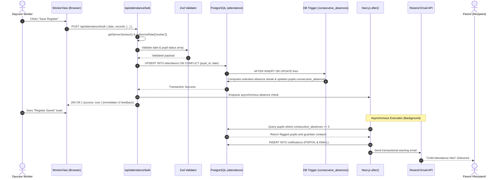
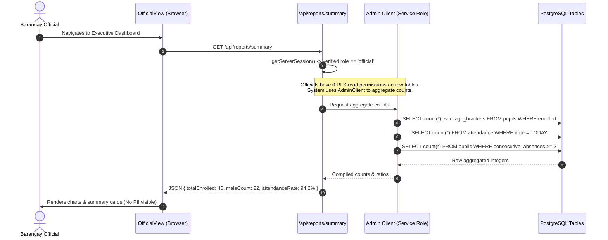

# SYSTEM ARCHITECTURE GUIDE
### Bacong Daycare Center Management System
**Technical Architecture & Infrastructure Reference for Capstone Defense**

---

## 1. ARCHITECTURAL OVERVIEW

The **Bacong Daycare Center Management System** is built using a **Modern Full-Stack Server-Side Rendered (SSR) Monolith with Backend-as-a-Service (BaaS)** pattern. 

Rather than deploying disparate, decoupled front-end and back-end repositories (e.g., a standalone React SPA communicating with a distinct Express/Django REST API), the system leverages **Next.js 15 App Router** to unite UI rendering, route authentication middleware, and server-side API endpoints within a single, cohesive codebase. Persistence, user authentication, and data-tier authorization are delegated to **Supabase (PostgreSQL)**, augmented by serverless edge services for rate limiting (**Upstash Redis**) and transactional communications (**Resend API**).

### Core Architectural Principles
1. **Zero Trust at the Client:** The client browser is considered completely untrusted. All authorizations, business rules, and data queries are validated on the server.
2. **Defense in Depth:** Security is not solely reliant on UI buttons or API checks; it is enforced across 5 distinct tiers (Middleware → Session Verification → RBAC Route Guard → Zod Validation → Database Row Level Security).
3. **Data Minimization (RA 10173):** Information is scoped strictly to user need. Barangay Officials receive pre-aggregated summary statistics via dedicated server logic, completely isolated from raw child records.
4. **Resilient Non-blocking Operations:** High-latency tasks like email alerts use background scheduling (`after()` hook) so that primary transactions (e.g., taking daily attendance) complete instantly for the daycare worker.

---

## 2. SYSTEM ARCHITECTURE DIAGRAMS

### A. High-Level Block Architecture (ASCII)

```
============================== USER TIER ==============================
   [ Daycare Worker Laptop ]   [ Barangay Official PC ]   [ Parent Smartphone ]
               \                      |                      /
                \                     |                     /
                 --- HTTPS (TLS 1.3) / HTTP-Only Cookies ---
                                      |
=========================== APPLICATION TIER ==========================
                     [ Next.js 15 Web Server ]
                                      |
       +------------------------------+-------------------------------+
       |                                                              |
 [ Edge Middleware ]                                          [ SSR Rendering ]
   src/middleware.ts                                            React Server
   - Session validation                                         Components
   - Public route allowlist                                     Client Components
   - 503 Fail-closed check                                      ('use client')
       |                                                              |
 [ API Route Handlers ] <---------------------------------------------+
   src/app/api/*
   - Authentication (getServerSession)
   - RBAC Gatekeeper (authorizeRole)
   - Input Sanitation (Zod schema validation)
   - Rate Limiting (Upstash Sliding Window)
   - Background Execution (Next.js after() hook)
   - Document Engines (jsPDF vector & JSZip DOCX generator)
       |
============================ DATA ACCESS TIER ==========================
       +------------------------------+-------------------------------+
       |                                                              |
 [ Browser Client ]             [ Server Session Client ]      [ Admin Client ]
   @supabase/ssr                  @supabase/ssr (Cookie-bound)   @supabase/supabase-js
   - Client sign-out              - RLS Enforced Queries         - Service Role Key
                                  - Scoped to user session       - server-only import
                                                                 - Summary aggregation
                                                                 - User provisioning
                                                                 - Immutable audit logs
       |                                      |                       |
======================= PERSISTENCE & SERVICES TIER ====================
       |                                      +-----------+-----------+
       |                                                  |
       v                                                  v
+-----------------------------+               +-----------------------+
|  Upstash Redis (Serverless) |               |  Supabase PostgreSQL  |
|  - Sliding window counters  |               |  - 16 Relational Tabs |
|  - IP/Action rate limiting  |               |  - 30+ RLS Policies   |
+-----------------------------+               |  - Absence Trigger    |
                                              |  - SECURITY DEFINER   |
+-----------------------------+               |  - Composite Indexes  |
|  Resend Transactional API   |               +-----------------------+
|  - Parent absence notices   |
+-----------------------------+
```

---

### B. Mermaid Component Diagram

```mermaid
flowchart TD
    subgraph ClientTier ["1. Presentation & Client Tier"]
        Browser["User Browser (Desktop / Tablet / Mobile)"]
        LocalStorage["Browser LocalStorage (UI State Only)"]
    end

    subgraph AppTier ["2. Application Tier (Next.js 15 Server)"]
        MW["Middleware (src/middleware.ts)\nRoute Guards & 503 Enforcer"]
        RSC["React Server Components\n(SSR Initial Hydration)"]
        CC["React Client Components\n(DaycareContext & Views)"]
        API["API Route Handlers (/api/*)"]
        Zod["Zod Validation Layer"]
        RateLimiter["Rate Limiting Logic"]
        DocEngines["Doc Engines (jsPDF & JSZip DOCX)"]
        AfterHook["Next.js after() Async Task"]
    end

    subgraph DataAccessTier ["3. Data Access Tier (Supabase Clients)"]
        BrowserClient["Browser Client (@supabase/ssr)"]
        ServerClient["Server Client (Cookie Session / RLS Bound)"]
        AdminClient["Admin Client (Service Role / server-only)"]
    end

    subgraph ServiceTier ["4. External Services & Persistence Tier"]
        Redis["Upstash Redis (REST Sliding Window)"]
        Resend["Resend API (Transactional Email)"]
        Postgres[("Supabase PostgreSQL DB\n• 16 Tables\n• 30+ RLS Policies\n• Absence Recalculation Trigger")]
    end

    Browser <-->|HTTPS / HTTP-only Cookies| MW
    MW --> RSC
    MW --> API
    RSC --> CC
    CC <-->|fetch JSON| API
    CC <--> LocalStorage

    API --> Zod
    Zod --> RateLimiter
    RateLimiter <-->|REST API| Redis
    API --> DocEngines
    API --> AfterHook
    AfterHook -->|Async Dispatch| Resend

    CC --> BrowserClient
    API --> ServerClient
    API --> AdminClient

    ServerClient <-->|Session SQL (RLS Filtered)| Postgres
    AdminClient <-->|Admin SQL (Bypass RLS)| Postgres
```

---

### C. Operational & Role-Based Workflow Flowchart

The following flowchart maps the system's operational workflow and actor interactions based on the system design board (omitting branding sheets), covering Super Admin controls, Teacher/Worker operations, Security/Gate verification with punch deduplication, daily classroom entry, cohort archiving, Barangay Official oversight, Parent monitoring, and Child Development Center operations:

```mermaid
flowchart TD
    %% Core Pillars
    subgraph CorePillars ["System Operational Pillars"]
        direction LR
        CP1["🔔 Notify System"]
        CP2["📋 Log Attendance"]
        CP3["💾 Manage Data"]
    end

    %% Super Admin Subgraph
    subgraph SuperAdmin ["Super Admin"]
        direction TB
        SA1["Create, Edit, Disable Accounts"]
        SA2["Manage RFID Cards & Student Profiles"]
        SA3["System Config (Time, Date, Session Rules)"]
        SA4["System Logs, Analytics & Reports"]
        SA5["User Administration"]
        SA6["Data Import"]
        SA7["Backups & Restore"]
    end

    %% Admin (Teacher) Subgraph
    subgraph AdminTeacher ["Admin (Teacher / Daycare Worker)"]
        direction TB
        AT1["Create, Edit, Disable Accounts"]
        AT2["Request Correction"]
        AT3["Student Profile Viewing"]
        subgraph AT_Dash ["Early Intervention Analytics (Scoped Real-Time Dashboard)"]
            AT4["Mark Student Status:<br/>• Present<br/>• Absent<br/>• Late<br/>• Missing"]
            AT5["NOTIFY (Absence & Milestone Alerts)"]
        end
        AT6["Class-Level Reporting"]
    end

    %% Security & Gate Monitoring
    subgraph SecurityGate ["Security & Entry Verification"]
        direction TB
        SG1["Live Gate Monitoring"]
        SG2["Manual Entry Logging"]
        SG3["Unauthorized Exit Alerts"]
        SG4{"Duplication Error Check:<br/>If check-in > once?"}
        SG5["Flag Duplicated Punch"]
        SG1 --> SG4
        SG4 -- Yes --> SG5
    end

    %% Daily Entry & Attendance Pipeline
    subgraph DailyFlow ["Daily Attendance & Classroom Pipeline"]
        direction LR
        DF_Entry["[ENTRY] Gate Check-in"]
        DF_Log["[LOG FOR TODAY] Daily Register"]
        DF_Class["[CLASSROOM] Distribution"]
        DF_Entry --> DF_Log
        DF_Log --> DF_Class
    end

    %% Archiving & Batch Tracking
    subgraph Archiving ["Archiving & Cohort Tracking"]
        direction TB
        Batch2026["Batch 2026 (Section: gr5 | Juan Dela Cruz)"]
        Batch2027["Batch 2027 (Section: gr6 | Juan Dela Cruz)"]
        Batch2028["Batch 2028"]
        Batch2029["Batch 2029"]
    end

    %% Barangay Official
    subgraph BrgyOfficial ["Barangay Official (BRGY / OFF)"]
        direction TB
        BO1["Executive Dashboard (Aggregated Insights)"]
        BO2["Export Summary Reports"]
        BO3["Backup & Restore Access"]
        BO4["Audit Logs Review"]
        BO5["Import Records"]
        BO6["Manage Account / Profile"]
        BO1 --> BO6
    end

    %% Parent / User
    subgraph ParentUser ["Parent / User Portal"]
        direction TB
        P_Enroll["Enrollment: Upload Requirements"]
        subgraph P_Monitor ["Monitoring"]
            P_Status["View Child Status"]
            P_Report["View Child Report (ECCD)"]
            P_Notif["Receive System Notifications"]
        end
        P_Feedback["Parent Feedback & Inquiries (Image Report)"]
    end

    %% Child Development Center Operations
    subgraph ChildDevCenter ["Child Development Center Management"]
        direction TB
        CDC1["Monitoring & Supervision"]
        CDC2["Manage Student Profiles"]
        CDC3["Log Daily Activities"]
        CDC4["Export Administrative Reports"]
        CDC5["Manage Student Attendance<br/>(Visual Attendance Monitoring Graph)"]
        CDC6["Enrollment Import"]
        subgraph CDC_Feedback ["Parent Feedback Dispatch"]
            CDC7["Notify Parent"]
            CDC8["Image Report Attachment"]
        end
        CDC9["Monthly Reporting"]
        CDC10["Financial Tracking (Invoice / Other Fee)"]
    end

    %% Inter-subgraph Connections
    DF_Entry -.-> SG1
    SG4 -- Valid Entry --> DF_Log
    DF_Log --> AT4
    AT5 --> P_Notif
    CDC_Feedback --> P_Feedback
    DF_Class --> Archiving
```




---

## 3. TIER-BY-TIER ARCHITECTURAL BREAKDOWN

### Tier 1: Presentation & Client Tier
- **Technology:** React 19, Tailwind CSS 3, Lucide React, Next.js Font Optimization (`Nunito` & `Quicksand`).
- **Responsibility:** Capturing user inputs, displaying dashboard visualizations, triggering downloads, and providing accessible interactive UI.
- **Client Architecture:**
  - **No Heavy Client-Side Routing:** The app runs as an SPA-like interface within `/` once authenticated. Active modules (`dashboard`, `pupils`, `progress`, `parent_notes`, `users`, `audit_logs`) transition via state flags within views rather than browser reloads, maximizing responsiveness.
  - **Accessible Dialogs:** Modals rely on the custom [`useModalA11y`](file:///C:/Bacong%20Daycare/src/hooks/useModalA11y.ts) hook to implement strict WCAG keyboard focus trapping, restoring focus to invoking triggers upon dismissal.
  - **State Segregation:** Shared data lives in `DaycareContext.tsx`. Temporary form edits (such as inline attendance edits or draft marks) stay inside view-local states until explicitly persisted.

### Tier 2: Edge & Application Routing Tier
- **Technology:** Next.js Edge Middleware (`src/middleware.ts`).
- **Responsibility:** First line of defense before any route or page handler is invoked.
- **Operational Logic:**
  1. **Strict Path Discrimination:** Evaluates `request.nextUrl.pathname` using an exact match or trailing-slash rule against `PUBLIC_PATHS` (`/login`, `/register`, `/auth`, `/reset-password`, `/privacy`). Prevents route spoofing (e.g., `/privacy-policy` cannot slip past as `/privacy`).
  2. **Fail-Closed Environment Validation:** If database connection variables are missing in production (`NODE_ENV === 'production'`), it halts execution immediately and serves an HTTP `503 Service Unavailable`, preventing unconfigured execution.
  3. **Session Refresh:** Interacts with `@supabase/ssr` to read, validate, and refresh JWT auth cookies in flight. Unauthenticated requests to protected paths are redirected to `/login`.

### Tier 3: Business Logic & API Tier
- **Technology:** Next.js Route Handlers (`src/app/api/*/route.ts`), TypeScript, Zod.
- **Responsibility:** Request parsing, RBAC validation, transactional database writes, document assembly, and audit trail dispatch.
- **Standard Request Processing Pipeline:**
  ```
  Incoming Request
         │
         ▼
  1. getServerSession() ────────► Reads user session cookie & queries public.users
         │                        (Ensures account is active; extracts verified role)
         ▼
  2. authorizeRole([roles]) ────► Returns 403 Forbidden if role is not permitted
         │
         ▼
  3. Zod.safeParse() ───────────► Returns 400 Bad Request if schema is violated
         │
         ▼
  4. checkRateLimit() ──────────► Queries Upstash Redis sliding window (429 if exceeded)
         │
         ▼
  5. DB Execution ──────────────► Runs via ServerClient (RLS) or AdminClient (Elevated)
         │
         ▼
  6. recordAudit() ─────────────► Appends immutable entry to public.audit_log
         │
         ▼
  7. after() Task ──────────────► Fires background jobs (notifications/email)
         │
         ▼
  Response Output (JSON / Streamed Binary)
  ```

### Tier 4: Data Access Tier (The 3 Supabase Clients)
A critical architectural facet of this project is the **deliberate triage of database clients**:

| Client | Implementation | Environment | Security Context | Used For |
|---|---|---|---|---|
| **Browser Client** | `createBrowserClient` (`src/lib/supabase/client.ts`) | Browser | User JWT Session | User sign-out (`supabase.auth.signOut()`) |
| **Server Session Client** | `createServerClient` (`src/lib/supabase/server.ts`) | Next.js Server | User JWT Session | Standard API operations. Row Level Security policies are actively enforced. |
| **Admin Client** | `createClient` (`src/lib/supabase/admin.ts`) | Next.js Server | Service Role Key | Elevated system operations. Bypasses RLS. Enforced with `import 'server-only'` to prevent bundling leaks. |

> [!IMPORTANT]
> **Why three clients?**
> A common student mistake is using a single database connection everywhere. In this system, if an API endpoint queries pupil records using the *Server Session Client*, PostgreSQL itself stops a parent from seeing another child's record. The *Admin Client* is only utilized when crossing trust boundaries (such as computing anonymized summaries for Barangay Officials).

### Tier 5: Persistence & Database Tier
- **Technology:** Managed PostgreSQL 15+ (Supabase).
- **Responsibility:** ACID transactional storage, relational constraint enforcement, automated calculations via triggers, and row filtering via RLS.
- **Database Architecture Highlights:**
  - **16 Relational Tables** normalized to eliminate data redundancies while preserving historical assessment integrity.
  - **Autonomous Absence Recalculation:** The `calculate_consecutive_absences` database trigger calculates pupil absences directly inside the SQL engine using a window function over an ordered 120-day temporal window.
  - **Singleton Enforcement:** The `center_settings` table uses a boolean primary key constraint (`CHECK (id = true)`), mathematically preventing more than one configuration record from existing.

### Tier 6: External Cloud Services
- **Upstash Redis:** Provides low-latency, HTTP-based distributed sliding-window rate limiting. Because Next.js serverless functions do not maintain long-lived TCP connections, Upstash’s RESTful protocol prevents connection pool exhaustion.
- **Resend API:** Transactional email relay. Invoked asynchronously during attendance processing to dispatch absence notifications to parents without impeding teacher workflows.

---

## 4. END-TO-END DATA FLOW ARCHITECTURE

### Flow 1: Daily Attendance Submission & Async Alert Pipeline



---

### Flow 2: Official Aggregate Reporting (Data Privacy Architecture)



---

### Flow 3: Secure ECCD Document Generation Pipeline

```mermaid
sequenceDiagram
    autonumber
    actor User as Worker or Authorized Parent
    participant API as /api/eccd/report
    participant Loader as eccdRecordLoader.ts
    participant Admin as Admin Client
    participant DB as PostgreSQL ECCD Tables
    participant Docx as eccdDocx.ts (JSZip + DOM)
    participant Template as eccd-child-record-2.docx

    User->>API: GET /api/eccd/report?pupil_id=PUP-2026-001
    API->>API: getServerSession()
    alt Requesting user is Parent
        API->>Admin: Verify user_id is linked to pupil_id in guardians
        Admin->>DB: SELECT 1 FROM guardians WHERE pupil_id & user_id
        DB-->>Admin: Match confirmed (IDOR Check passed)
    end
    API->>Loader: loadEccdRecord(adminClient, pupilId)
    Loader->>DB: Parallel query: demographics, scores, observations, evaluations
    DB-->>Loader: Complete ECCD dataset
    Loader-->>API: Formatted ECCD Record Model
    API->>Docx: fillEccdDocx(templateBuffer, record)
    Docx->>Template: Read bundled DOCX as ZIP archive
    Docx->>Docx: Parse word/document.xml with DOMParser
    Docx->>Docx: Replace template placeholders & check boxes
    Docx->>Docx: Re-serialize XML and compress ZIP buffer
    Docx-->>API: ArrayBuffer (Filled Word Document)
    API-->>User: 200 OK (Content-Disposition: attachment; filename="ECCD_Record_...")
```

---

## 5. SECURITY & TRUST BOUNDARY ARCHITECTURE

The system implements strict **Trust Boundaries** where incoming data and control signals cross from insecure to secure environments:

```
[ UNTRUSTED ZONE: Browser / Public Internet ]
  • Client-side JavaScript
  • React Component State
  • URL Query Parameters & HTTP Request Bodies
──────────────────────── Boundary 1: Transport Security (HTTPS / TLS 1.3) ─────────────
[ PERIMETER ZONE: Edge Middleware ]
  • Route allowlists
  • Authentication Cookie verification
  • Fail-closed environment integrity check
──────────────────────── Boundary 2: Next.js Server Boundary ──────────────────────────
[ APPLICATION CONTROL ZONE: API Route Handlers ]
  • Session Extraction (`getServerSession`)
  • Role-Based Access Control (`authorizeRole`)
  • Input Sanitation & Validation (`Zod`)
  • Rate Limiting Protection (`Upstash Redis`)
  • Cryptographic Isolation (`server-only` Admin Client)
──────────────────────── Boundary 3: Database Network Boundary ────────────────────────
[ SECURE DATA PERSISTENCE ZONE: PostgreSQL Engine ]
  • Row Level Security (RLS) Filter Engine
  • SECURITY DEFINER function isolation (`current_user_role`)
  • Foreign Key, Unique, and Check Constraints
  • Automated Window Function Triggers
  • Immutable Append-Only Audit Logging
```

---

## 6. INFRASTRUCTURE & DEPLOYMENT ARCHITECTURE

### Production Deployment Topology
| Tier / Service | Host / Platform | Scaling Characteristics | Notes |
|---|---|---|---|
| **Web Server / Runtime** | Vercel / Node.js Runtime | Serverless Auto-scaling | Stateless edge/serverless execution. No sticky sessions needed. |
| **Database & Auth** | Supabase Managed Cloud (AWS ap-southeast-1) | Vertical scaling (compute/storage), pooled connections | PostgreSQL instance located in Singapore region for lowest Philippine latency (~30-50ms). |
| **Distributed Cache / Rate Limiting** | Upstash Redis Cloud | Serverless Pay-per-request | Global low-latency REST endpoints. |
| **Transactional Email** | Resend Cloud Infrastructure | API-driven asynchronous delivery | High deliverability transactional tier. |

### Minimum Hardware Requirements for Client Terminals
Because computation (SSR, PDF assembly, DOCX generation) takes place on the server, the system exhibits extremely low client footprint:
- **Daycare Worker Terminal:** Any device capable of running Google Chrome 110+, Microsoft Edge, or Safari. Minimum 2GB RAM. Compatible with entry-level laptops, Android tablets, or Chromebooks.
- **Parent / Official Terminal:** Any standard 4G/5G smartphone running mobile Chrome or Safari.

---

## 7. ARCHITECTURAL DECISIONS & TRADE-OFFS (ADRs)

### ADR 1: Full-Stack Next.js 15 Monolith vs. Decoupled Frontend/Backend
- **Decision:** Build both UI and API within a single Next.js App Router project.
- **Rationale:** 
  - Eliminates Cross-Origin Resource Sharing (CORS) complexity between separate domains.
  - Allows end-to-end TypeScript type sharing between database definitions and UI models.
  - Lowers deployment and hosting maintenance overhead for a public barangay facility.
- **Trade-off:** Heavy background tasks share runtime resources with web rendering. Mitigated by using lightweight libraries (e.g., jsPDF instead of headless Chrome) and delegating rate limiting to Redis.

### ADR 2: PostgreSQL Row Level Security (RLS) vs. Application-Only Authorization
- **Decision:** Enforce data access rules inside PostgreSQL via RLS policies in addition to API checks.
- **Rationale:** 
  - Application code can have unforeseen bugs, forgotten `WHERE` clauses, or IDOR vulnerabilities.
  - RLS guarantees that even if an attacker tricks an API endpoint into querying another pupil's data, the PostgreSQL engine refuses to return the rows.
- **Trade-off:** RLS policies can introduce query overhead if not indexed properly. Mitigated by composite indexes on `(pupil_id, date)` and `(recipient_user_id, read)`.

### ADR 3: Responsive Web Application vs. Native Android Application (APK)
- **Decision:** Build a mobile-optimized responsive web app rather than compiling a native APK.
- **Rationale:** 
  - Eliminates APK compilation, signing, distribution, and version fragmentation among parents.
  - Updates and security patches are live instantaneously upon deployment without requiring manual downloads.
  - Zero storage barrier for parents with budget smartphones possessing limited internal memory.
- **Trade-off:** No direct hardware-level SMS/Bluetooth integration and requires connectivity. Mitigated by clean responsive styling and a documented future PWA roadmap.

### ADR 4: In-Memory / Vector Document Generation vs. Headless Browser Canvas
- **Decision:** Use `jsPDF` for PDF reports and `JSZip + @xmldom/xmldom` for DOCX files.
- **Rationale:** 
  - Traditional `html2canvas` approaches produce massive 9MB rasterized images that consume excessive bandwidth and print poorly.
  - jsPDF produces authentic vector PDFs under ~270KB.
  - Filling native DOCX templates via XML avoids spinning up bloated headless browser engines (e.g., Puppeteer) on the server.
- **Trade-off:** Template formatting requires precise XML tag matching rather than simple HTML/CSS styling.

---

## 8. DEFENSE PRESENTATION SCRIPT: SYSTEM ARCHITECTURE

If a panelist asks: **"Can you explain the system architecture of your project?"**, deliver this 2-minute answer:

> *"Our system follows a **Full-Stack Server-Side Rendered Monolith with Backend-as-a-Service** architecture, built on Next.js 15 and Supabase.
>
> We chose this architecture over a traditional decoupled React-and-Express setup because it unites our user interface and our API routes within a single, secure TypeScript codebase.
>
> Architecturally, it is divided into four distinct tiers:
>
> First is the **Presentation Tier**, which runs in the user's browser. It is fully responsive across desktop and mobile, using React 19 Client Components for interactive forms and Server Components for initial rendering.
>
> Second is the **Application Tier**, running on Next.js. Here, our Edge Middleware acts as the first gatekeeper, inspecting session tokens and blocking unauthorized access before a page even loads. Incoming API requests pass through a strict security pipeline: session verification, role authorization, Zod schema validation, and Upstash Redis rate limiting.
>
> Third is the **Data Access Tier**, where we deliberately separate our database connections. Regular user actions use a session client bound to the user's cookie, meaning the database itself enforces what they can see. Privileged tasks — like generating the Officials' summary report or user account creation — run through an isolated, server-only admin client.
>
> Finally, the **Persistence Tier** is powered by Supabase PostgreSQL. We don't just store data there; we use the database engine itself for security and automation. We have over 30 Row Level Security policies enforcing data privacy at the SQL level, and a custom database trigger that automatically recalculates consecutive absence streaks without relying on application code.
>
> This architecture ensures strong data privacy compliance under RA 10173, zero-trust security, and fast, reliable performance for the Barangay Bacong Daycare Center."*

---

*System Architecture Guide — Bacong Daycare Center Management System*
